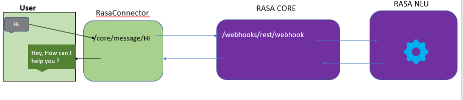

# RasaConnector

This is a sample project to connect Rasa core

*You can change the Rasa core url in application.properties file
For me its running on http://localhost:5005

Exposed Endpoints :-

GET - http://(ip add:port)/core/message/(your_message)
  
Sample Request and Response :
1. http://localhost:8980/core/message/hi

response :-
[
  {
    "recepient_id":"default",
    "text":"Hey,How can I help you ?"
  }
]

